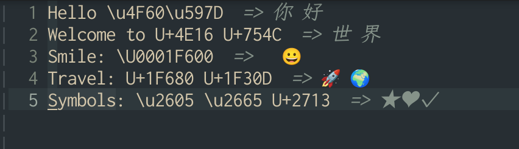

# unicode_preview.vim

A small Vim plugin that previews Unicode literals inline by appending decoded characters as virtual text at the end of each line.



## Features

- Preview Unicode literals inline using virtual text
- Support the following formats:
  - `\uXXXX`
  - `\UXXXXXXXX`
  - `U+XXXX` to `U+XXXXXX`
- Group multiple decoded characters on the same line into one preview
- Automatically refresh on buffer enter, scrolling, and text changes
- Scan only the visible window by default for better performance
- Echo the Unicode literal near the cursor
- Echo all Unicode literals on the current line
- Ignore invalid Unicode code points safely

## Commands

### `:UnicodePreviewShow`

Enable Unicode preview for the current buffer.

### `:UnicodePreviewHide`

Disable Unicode preview for the current buffer and clear existing virtual text.

### `:UnicodePreviewRefresh`

Force a refresh of the Unicode preview.

### `:UnicodePreviewToggle`

Toggle Unicode preview on or off for the current buffer.

### `:UnicodePreviewEcho`

Echo the Unicode literal under, after, or nearest before the cursor on the current line.

### `:UnicodePreviewEchoLine`

Echo all Unicode literals found on the current line.

## Default Behavior

When the plugin loads, it defines commands and autocommands.

By default, it automatically enables preview on `BufEnter` for buffers that have not been initialized yet.

It also refreshes automatically when:

- the window is scrolled
- the buffer text changes in Normal mode
- the buffer text changes in Insert mode

Manual enable or disable state is stored per buffer and is preserved when you switch away from and back to the buffer.

## Options

### `g:unicode_preview_auto_enable`

Whether preview should automatically start on `BufEnter` for a newly entered buffer.

- Type: Number / Boolean
- Default: `1`

Example:

```vim
let g:unicode_preview_auto_enable = 0
```

---

### `g:unicode_preview_visible_only`

Whether to scan only the visible window plus extra context.

- Type: Number / Boolean
- Default: `1`

When enabled, the plugin scans only the visible area and nearby lines.  
When disabled, it scans the entire buffer.

Example:

```vim
let g:unicode_preview_visible_only = 0
```

---

### `g:unicode_preview_context`

Number of extra lines to scan above and below the visible window when `g:unicode_preview_visible_only` is enabled.

- Type: Number
- Default: `20`

Example:

```vim
let g:unicode_preview_context = 10
```

---

### `g:unicode_preview_prefix`

Prefix text inserted before the decoded preview text.

- Type: String
- Default: `'  => '`

Example:

```vim
let g:unicode_preview_prefix = '  => '
```

---

### `g:unicode_preview_separator`

Separator used between multiple decoded characters on the same line.

- Type: String
- Default: `' '`

Example:

```vim
let g:unicode_preview_separator = ' | '
```

## Buffer-local State

### `b:unicode_preview_enabled`

Whether preview is enabled for the current buffer.

- Type: Number / Boolean
- Managed by:
	- `:UnicodePreviewShow`
	- `:UnicodePreviewHide`
	- `:UnicodePreviewToggle`
	- automatic initialization on `BufEnter`

This is the actual runtime state used by refresh logic.

## Default Values

```vim
let g:unicode_preview_auto_enable = 1
let g:unicode_preview_visible_only = 1
let g:unicode_preview_context = 20
let g:unicode_preview_prefix = '  => '
let g:unicode_preview_separator = ' '
```

## Highlight Group

The plugin uses the highlight group:

- `UnicodePreviewVirtual`

By default, it is linked to `Comment`.

You can override it in your Vim config, for example:

```vim
highlight link UnicodePreviewVirtual SpecialComment
```
