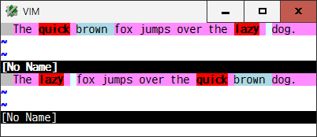
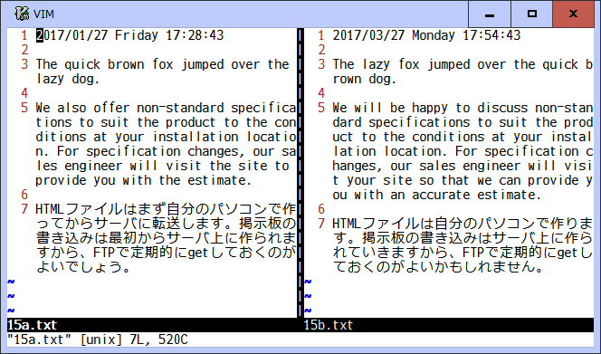

# diffchar.vim
*Highlight the exact differences, based on characters and words*
```
 ____   _  ____  ____  _____  _   _  _____  ____   
|    | | ||    ||    ||     || | | ||  _  ||  _ |  
|  _  || ||  __||  __||     || | | || | | || | ||  
| | | || || |__ | |__ |   __|| |_| || |_| || |_||_ 
| |_| || ||  __||  __||  |   |     ||     ||  __  |
|     || || |   | |   |  |__ |  _  ||  _  || |  | |
|____| |_||_|   |_|   |_____||_| |_||_| |_||_|  |_|
```

#### Introduction

This plugin has been developed in order to make diff mode more useful. Vim
highlights all the text in between the first and last different characters on
a changed line. But this plugin will find the exact differences between them,
character by character - so called *DiffChar*.

For example, in diff mode:  


this plugin will exactly show the changed and added units:  


This plugin will synchronously show/reset the highlights of the exact
differences as soon as the diff mode begins/ends since a `g:DiffModeSync` is
enabled as a default. And the exact differences will be kept updated while
editing.  

You can use `:SDChar` and `:RDChar` commands to manually show and reset the
highlights on all or some of lines. To toggle the highlights, use `:TDChar` 
command.

This plugin shows the differences based on a `g:DiffUnit`. Its default is
'Word1' and it handles a \w\+ word and a \W character as a difference unit.
There are other types of word provided and you can also set 'Char' to compare
character by character.

In diff mode, the corresponding changed lines are compared between two
windows. You can set a matching color to a `g:DiffColors` to make it easy to
find the corresponding units between two windows. As a default, all the
changed units are highlighted with DiffText. In addition, DiffAdd is always
used for the added units and both the previous and next character of the
deleted units are shown in bold/underline.

When the diff mode begins, this plugin detects the limited number of the
DiffChange lines, specified by a `g:DiffMaxLines`, in the current visible and
upper/lower lines of the window. And whenever a cursor is moved onto another
line, it detects the DiffChange lines again. It is useful for a large file
because, independently of the file size, the number of lines to be detected
and then the time consumed are always constant. Its default is 300 lines (100
lines if an external diff command is not available for performance reason).
The height of the current window is used instead if the value is less than it.
If 0 is specified, it disables and detects all DiffChange lines only when the
diff mode begins.

While showing the exact differences, when cursor is moved on a difference
unit, you can see its corresponding unit with cursor-like highlight in another
window, and also its whole string with the assigned color as a message,
based on `g:DiffPairVisible`.

You can use `]b` or `]e` to jump cursor to start or end position of the next
difference unit, and `[b` or `[e` to the start or end position of the previous
unit. Those keymaps are configurable in your vimrc and so on.

Like line-based `:diffget`/`:diffput` and `do`/`dp` vim commands, you can use
<Leader>g and <Leader>p commands in normal mode to get and put each difference
unit, where the cursor is on, between 2 buffers and undo its difference.

In order to check the actual differences in a line, you can use `:EDChar`
command and echo the lines for range. A changed, added, and deleted unit is
shown as `[-...-][+...+]`, `[+...+]`, and `[-...-]` respectively, while showing its
highlight. If a strike highlighting is available such as on GUI and some
terminal, the deleted unit is highlighted with the strike instead and `[+`, `+]`,
`[-`, and `-]` are eliminated. This command tries to shorten some equivalent units
and show `...` instead, if the line is too long to fit on the command line.
The line number is shown if `number` or `relativenumber` option is set in the
window. When [!] is used, nothing is shorten and all lines are displayed.

This plugin has been using "An O(NP) Sequence Comparison Algorithm" developed
by S.Wu, et al., which always finds an optimum sequence quickly. But for
longer lines and less-similar files, it takes time to complete the diff
tracing. To make it more efficient, this plugin splits the tracing with the
external diff command. Firstly applies the internal O(NP) algorithm. If not
completed within the time specified by a `g:DiffSplitTime`, continuously
switches to the diff command at that point, and then joins both results. This
approach provides a stable performance and reasonable accuracy, because the
diff command effectively optimizes between them. Its default is 100 ms, which
would be useful for smaller files. If prefer to always apply the internal
algorithm for accuracy (or the diff command for performance), set some large
value (or 0) to it.

This plugin works on each tab page individually. You can use a tab page
variable (t:), instead of a global one (g:), to specify different options on
each tab page.

This plugin has been always positively supporting mulltibyte characters.

#### Commands

* `:[range]SDChar`
  * Show the highlights of difference units for [range]
* `:[range]RDChar`
  * Reset the highlights of difference units for [range]
* `:[range]TDChar`
  * Toggle to show/reset the highlights for [range]
* `:[range]EDChar[!]`
  * Echo the line for [range], by showing each corresponding unit together
    in `[+...+]`/`[-...-]` or strike highlighting. Some equivalent units may be
    shown as `...`. The line number is shown if `number` or `relativenumber`
    option is set in the window. When [!] is used, all lines and all units
    are displayed.

#### Keymaps

* `<Plug>JumpDiffCharPrevStart` (default: `[b`)
  * Jump cursor to the start position of the previous difference unit
* `<Plug>JumpDiffCharNextStart` (default: `]b`)
  * Jump cursor to the start position of the next difference unit
* `<Plug>JumpDiffCharPrevEnd` (default: `[e`)
  * Jump cursor to the end position of the previous difference unit
* `<Plug>JumpDiffCharNextEnd` (default: `]e`)
  * Jump cursor to the end position of the next difference unit
* `<Plug>GetDiffCharPair` (default: `<Leader>g`)
  * Get a corresponding difference unit from another buffer to undo difference
* `<Plug>PutDiffCharPair` (default: `<Leader>p`)
  * Put a corresponding difference unit to another buffer to undo difference

#### Options

* `g:DiffUnit`, `t:DiffUnit` - Type of difference unit
  * 'Word1'  : \w\\+ word and any \W single character (default)
  * 'Word2'  : non-space and space words
  * 'Word3'  : \\< or \\> character class boundaries
  * 'Char'   : any single character
  * 'CSV(,)' : separated by characters such as ',', ';', and '\t'
* `g:DiffColors`, `t:DiffColors` - Matching colors for changed unit pairs (always DiffAdd for added units)
  * 0   : always DiffText (default)
  * 1   : 4 colors in fixed order
  * 2   : 8 colors in fixed order
  * 3   : 16 colors in fixed order
  * 100 : all colors defined in highlight option in dynamic random order
* `g:DiffModeSync`, `t:DiffModeSync`- Synchronously show/reset/update with diff mode
  * 1 : enable (default)
  * 0 : disable
* `g:DiffMaxLines`, `t:DiffMaxLines` - A maximum number of DiffChange lines to be dynamically detected
  * 1 ~ : (300 as default, 100 if diff commend not available)
  * 0 : disable (detect all DiffChange lines only when a diff mode begins)
* `g:DiffPairVisible`, `t:DiffPairVisible` - Make a corresponding unit visible when cursor is moved on a difference unit
  * 2 : highlight with cursor-like color plus echo as a message (default)
  * 1 : highlight with cursor-like color
  * 0 : nothing visible
* `g:DiffSplitTime`, `t:DiffSplitTime` - A time length (ms) to apply the internal algorithm first
  * 0 ~ : (100 as default)

#### Demo


```viml
:let t:DiffModeSync = 0
:windo diffthis | windo set wrap
:%SDChar
:%RDChar
:diffoff!

:let t:DiffModeSync = 1        " this is a default value
:windo diffthis | windo set wrap
:diffoff!

:let t:DiffColors = 3
:windo diffthis | windo set wrap
:EDChar          " echo line 3 together with corresponding difference unit
:%EDChar!        " echo all lines along with the line number

<space>          " move cursor forward on line 1 and
<space>          " make its corresponding unit pair visible
...
]b\g             " jump to the next difference unit on line 3 and
]b\g             " get each unit pair from another buffer to undo difference
...

:diffoff!
```
