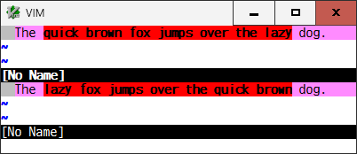

# diffchar.vim
*Highlight the exact differences, based on characters and words*
```
 ____   _  ____  ____  _____  _   _  _____  ____   
|    | | ||    ||    ||     || | | ||  _  ||  _ |  
|  _  || ||  __||  __||     || | | || | | || | ||  
| | | || || |__ | |__ |   __|| |_| || |_| || |_||_ 
| |_| || ||  __||  __||  |   |     ||     ||  __  |
|     || || |   | |   |  |__ |  _  ||  _  || |  | |
|____| |_||_|   |_|   |_____||_| |_||_| |_||_|  |_|
```

#### Introduction

This plugin has been developed in order to make diff mode more useful. Vim
highlights all the text in between the first and last different characters on
a changed line. But this plugin will find the exact differences between them,
character by character - so called *DiffChar*.

For example, in diff mode:  


This plugin will exactly show the changed and added units:  


This plugin will synchronously show/reset the highlights of the exact
differences as soon as the diff mode begins/ends. And the exact differences
will be kept updated while editing.

This plugin shows the differences based on a `g:DiffUnit`. Its default is
'Word1' and it handles a \w\\+ word and a \W character as a difference unit.
There are other types of word provided and you can also set 'Char' to compare
character by character.

In diff mode, the corresponding `hl-DiffChange` lines are compared between two
windows. You can set a matching color to a `g:DiffColors` to make it easy to
find the corresponding units between two windows. As a default, all the
changed units are highlighted with `hl-DiffText`. In addition, `hl-DiffAdd` is
always used for the added units and both the previous and next character of
the deleted units are shown in bold/underline.

While showing the exact differences, when the cursor is moved on a difference
unit, you can see its corresponding unit with `hl-Cursor` in another window,
based on `g:DiffPairVisible`. If you change its default, the corresponding
unit is echoed in the command line or displayed in a popup/floating window
just below the cursor position or at the mouse position.

You can use `]b` or `]e` to jump cursor to start or end position of the next
difference unit, and `[b` or `[e` to the start or end position of the previous
unit. Those keymaps are configurable in your vimrc and so on.

Like line-based `:diffget`/`:diffput` and `do`/`dp` vim commands, you can use
`<Leader>g` and `<Leader>p` commands in normal mode to get and put each
difference unit, where the cursor is on, between 2 buffers and undo its
difference.

When the diff mode begins, this plugin locally checks the `hl-DiffChange`
lines in the limited range of the current visible and its upper/lower lines of
a window. And each time a cursor is moved on to a different range upon
scrolling or searching, the new `hl-DiffChange` lines will be incrementally
checked in that range. Which means, independently of the file size, the number
of lines to be checked and then the time consumed are always constant.

This plugin works on each tab page individually. You can use a tab page
variable (t:), instead of a global one (g:), to specify different options on
each tab page. Note that this plugin can not handle more than two diff mode
windows in a tab page. If it would happen, to prevent any trouble, all
highlighted DiffChar units are to be reset in the tab page.

To find the exact differences, this plugin uses "An O(NP) Sequence Comparison
Algorithm" developed by S.Wu, et al., which always finds an optimum sequence.
But it takes time to check a long and dissimilar line. To improve the
performance, if there are so many diff units included in a line or it has
taken much time in a diff session, this plugin tries to use the external diff
command together if available.

#### Keymaps

* `<Plug>JumpDiffCharPrevStart` (default: `[b`)
  * Jump cursor to the start position of the previous difference unit
* `<Plug>JumpDiffCharNextStart` (default: `]b`)
  * Jump cursor to the start position of the next difference unit
* `<Plug>JumpDiffCharPrevEnd` (default: `[e`)
  * Jump cursor to the end position of the previous difference unit
* `<Plug>JumpDiffCharNextEnd` (default: `]e`)
  * Jump cursor to the end position of the next difference unit
* `<Plug>GetDiffCharPair` (default: `<Leader>g`)
  * Get a corresponding difference unit from another buffer to undo difference
* `<Plug>PutDiffCharPair` (default: `<Leader>p`)
  * Put a corresponding difference unit to another buffer to undo difference

#### Options

* `g:DiffUnit`, `t:DiffUnit` - A type of difference unit
  * 'Word1'  : \w\\+ word and any \W single character (default)
  * 'Word2'  : non-space and space words
  * 'Word3'  : \\< or \\> character class boundaries
  * 'Char'   : any single character
  * 'CSV(,)' : separated by characters such as ',', ';', and '\t'
* `g:DiffColors`, `t:DiffColors` - Matching colors for changed units (always `hl-DiffAdd` for added units)
  * 0   : always `hl-DiffText` (default)
  * 1   : 4 colors in fixed order
  * 2   : 8 colors in fixed order
  * 3   : 16 colors in fixed order
  * 100 : all colors defined in highlight option in dynamic random order
* `g:DiffPairVisible`, `t:DiffPairVisible` - Visibility of corresponding diff units
  * 0 : disable
  * 1 : highlight with `hl-Cursor` (default)
  * 2 : highlight with `hl-Cursor` + echo in the command line
  * 3 : highlight with `hl-Cursor` + popup/floating window at cursor position
  * 4 : highlight with `hl-Cursor` + popup/floating window at mouse position

#### Demo


